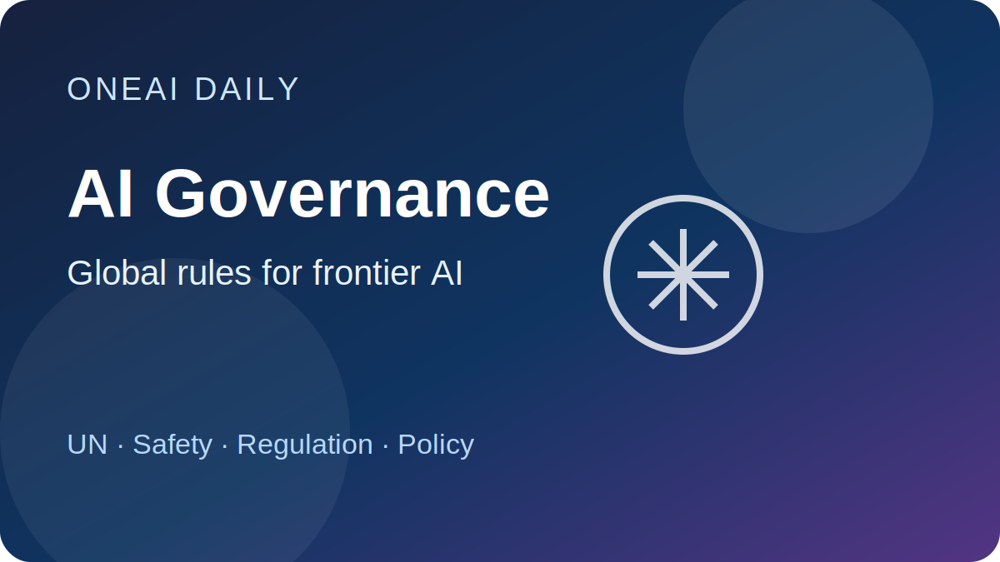
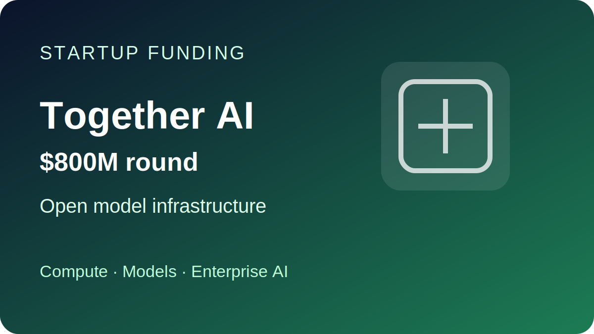
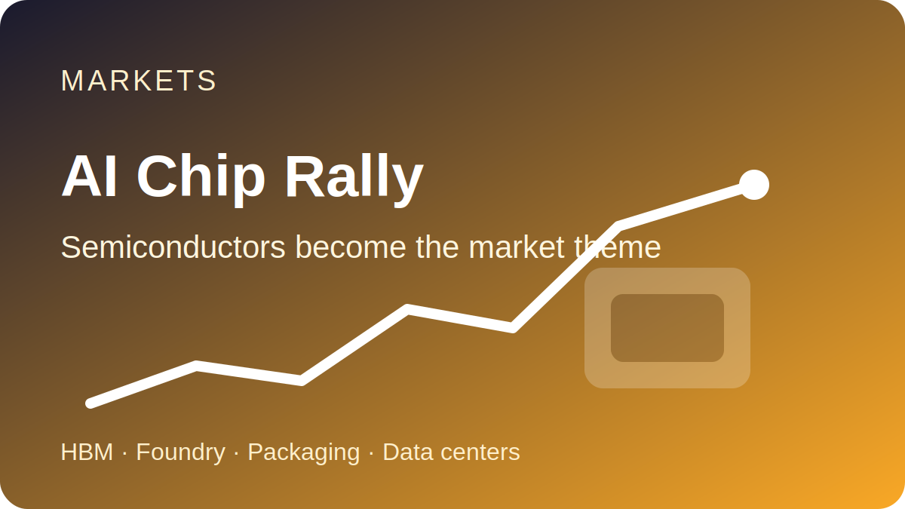
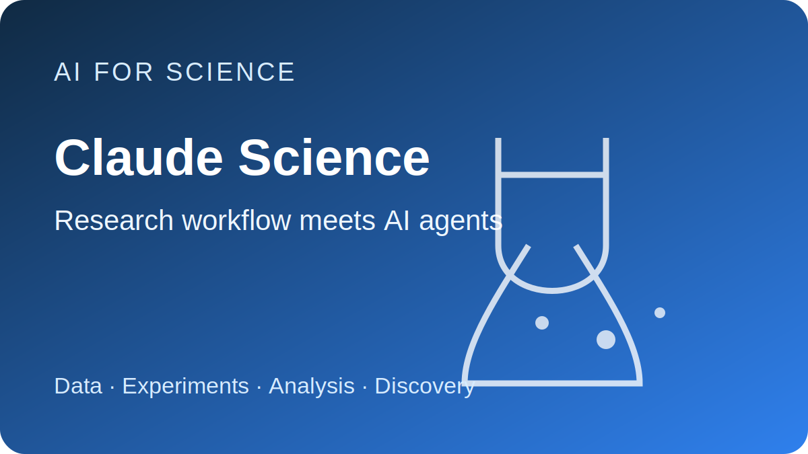

# OneAI Daily｜2026 年 7 月 2 日

> 5 条重点新闻，覆盖 AI、科技、商业、科学、政策、创业、全球新闻、工程与体育。

---

## 1. 联合国警告 AI 失控风险，并推动全球治理机制

联合国独立 AI 科学小组警告，AI 进展正在超过监管与科学理解速度，尤其是自主代理、欺骗行为、失控风险、网络攻击、虚假信息和生物安全滥用等问题。联合国同时推动 “AI for Good Global Commission”，希望把科技公司、政府与国际机构拉到同一张桌上。

**为什么重要：** AI 治理正在从原则讨论进入机构化协调阶段，未来可能影响模型评估、开源、出口管制和企业合规成本。

---

## 2. Together AI 融资 8 亿美元，估值升至 83 亿美元

Together AI 完成 8 亿美元融资，由 Aramco Ventures 领投，估值达到 83 亿美元。公司主打企业训练和运行开源模型的平台，支持 DeepSeek、MiniMax、Kimi 等模型，定位为比封闭 AI 系统更低成本的替代方案。

**为什么重要：** 资本继续押注“开放模型 + 算力平台”路线，说明企业 AI 市场并不只属于闭源大模型公司，基础设施层仍是融资主战场。

---

## 3. AI 芯片行情继续扩散，半导体成为市场主线

Reuters 市场评论称，2026 年上半年全球市场最突出的主线之一是 AI 资本开支推动半导体板块爆发；美国 SOX 半导体指数上半年接近翻倍，部分芯片相关公司涨幅极端。

**为什么重要：** AI 投资已经从大模型公司扩散到存储、封装、设备、代工和零部件供应链，但涨幅过快也意味着市场开始定价泡沫风险。

---

## 4. Anthropic 推出 Claude Science，瞄准科研工作流

Anthropic 发布 “Claude Science”，一个面向科学研究的 AI 工作台，用于数据分析、复杂计算工作流和研究管理，延续其在生命科学与医疗方向的布局。

**为什么重要：** 大模型竞争正在从通用聊天转向高价值垂直场景，科研、医药和工程工作流可能成为下一批企业级 AI 产品的核心战场。

---

## 5. 温网第三日：多位头号选手晋级，早轮竞争升温

温网第三日，Djokovic 直落三盘击败 Tsitsipas，Sinner、Medvedev、Gauff、Sabalenka、Osaka 等多位名将也晋级。女单方面，Krejcikova 逆转击败五号种子 Andreeva，成为当日重要冷门之一。

**为什么重要：** 今年温网早轮已呈现“老将状态回升 + 新星受压”的格局，男女单争冠路线正在快速重排。

---

## 公众号发布备注

- 建议标题：`OneAI Daily｜AI 治理、开源模型融资与半导体主线`
- Digest：`今日5条`
- 封面图：`assets/images/2026-07-02/01-ai-governance.svg`
- 发布状态：先保存到草稿箱，人工检查后发布。
