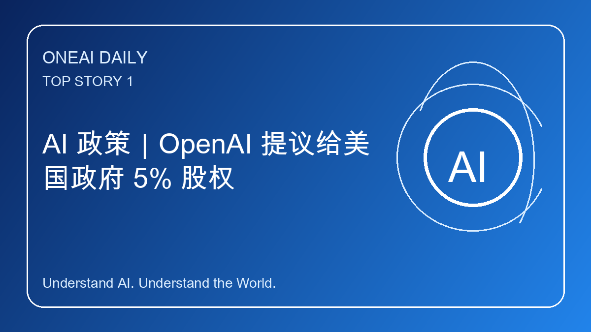
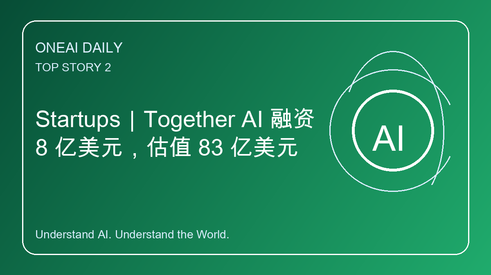
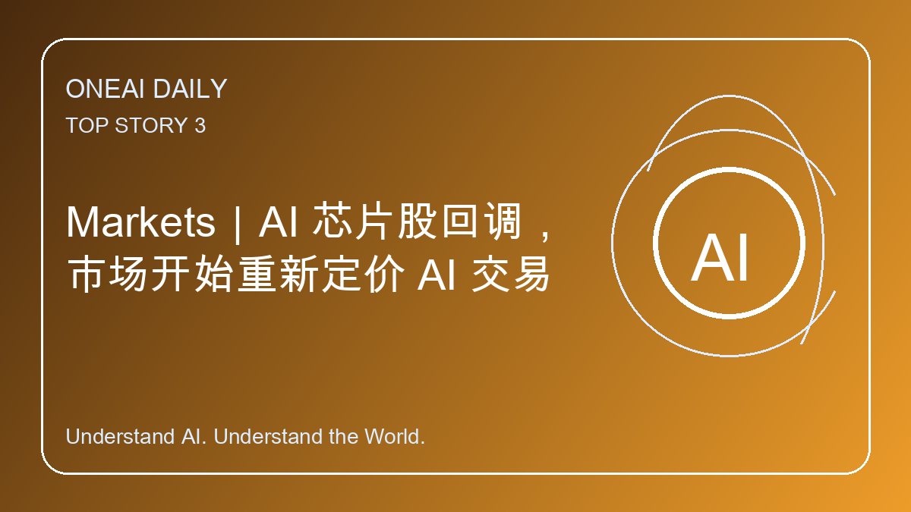
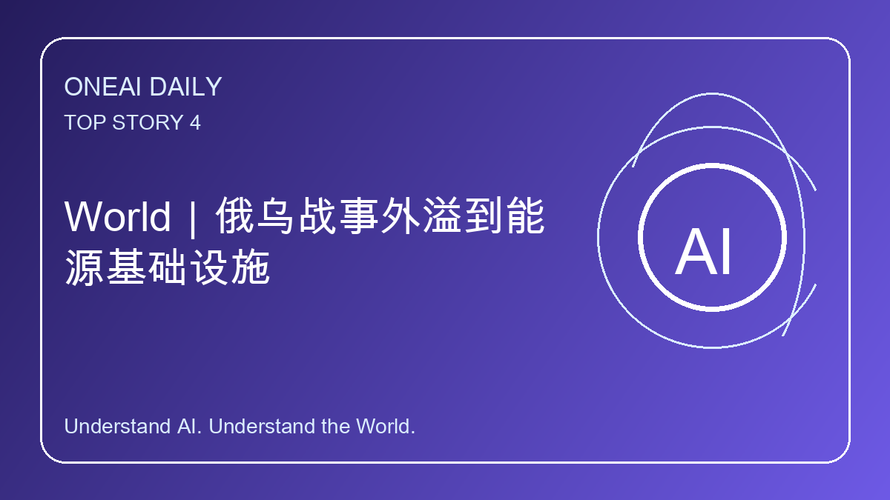
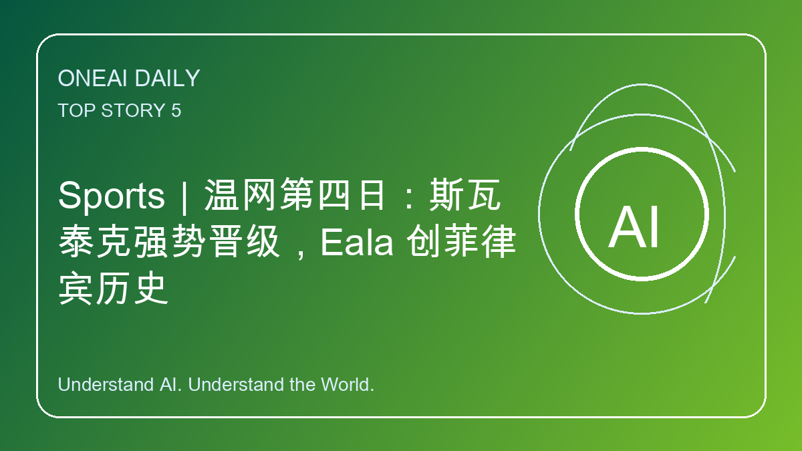

# OneAI Daily｜OpenAI、Together AI 与全球 AI 资本新动向

> 5 条重点新闻，覆盖 AI、科技、商业、科学、政策、创业、全球新闻、工程与体育。

---

## 1. AI 政策｜OpenAI 提议给美国政府 5% 股权

OpenAI 据报正讨论在 IPO 前向美国政府提供 5% 股权，作为“让公众分享 AI 红利”的方案，也是在华盛顿对前沿 AI 加强审查背景下的政治对冲。

**为什么重要：** 如果成形，AI 巨头可能进入“战略科技公司 + 国家股权”的新治理模式，未来会影响 AI 公司融资、监管与公共利益分配。

---

## 2. Startups｜Together AI 融资 8 亿美元，估值 83 亿美元

Together AI 完成 8 亿美元融资，由 Aramco Ventures 领投，估值升至 83 亿美元；公司主打企业可用的开源模型训练与推理平台。

**为什么重要：** 资本继续押注“开放模型 + AI 云基础设施”，也说明中东能源资本正在更深进入 AI 算力链。

---

## 3. Markets｜AI 芯片股回调，市场开始重新定价 AI 交易

美国半导体指数明显下跌，部分亚洲科技股也出现剧烈波动；与此同时，宏观数据与美元走势让市场重新评估高估值 AI 交易。

**为什么重要：** 市场不是放弃 AI，而是在从“无差别追高”转向检验 AI 资本开支、产能过剩和盈利兑现。

---

## 4. World｜俄乌战事外溢到能源基础设施

俄罗斯对基辅发动大规模导弹和无人机袭击；与此同时，乌克兰打击俄炼厂和油库后，俄罗斯多地出现燃油短缺、排队和价格上涨。

**为什么重要：** 战争正在从前线消耗转向能源系统互袭，可能影响粮食收割、国内民意与区域能源风险溢价。

---

## 5. Sports｜温网第四日：斯瓦泰克强势晋级，Eala 创菲律宾历史

卫冕冠军 Iga Swiatek 击败 Karolina Pliskova 晋级第三轮；Alexandra Eala 击败 Maya Joint，成为首位打进大满贯第三轮的菲律宾球员。

**为什么重要：** 女单格局出现新叙事：卫冕冠军状态回升，亚洲新星也在大满贯舞台制造历史突破。
