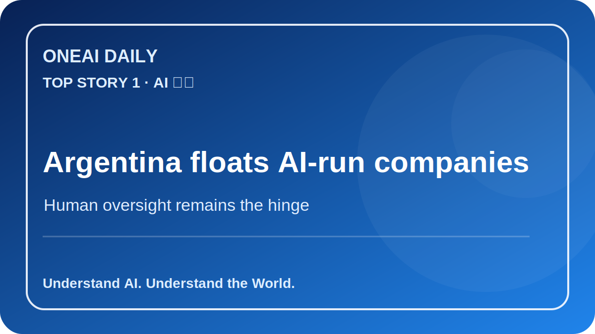
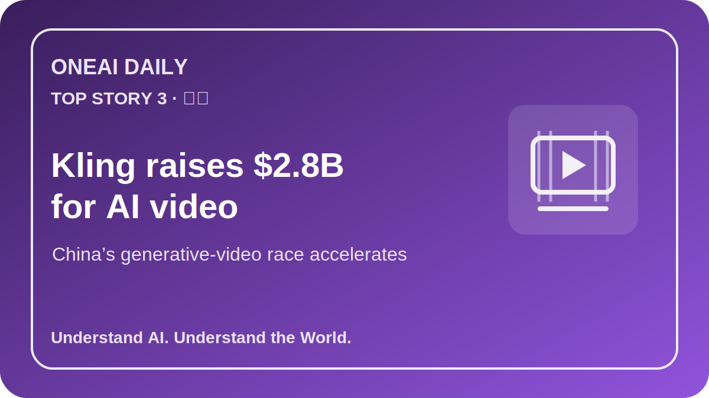
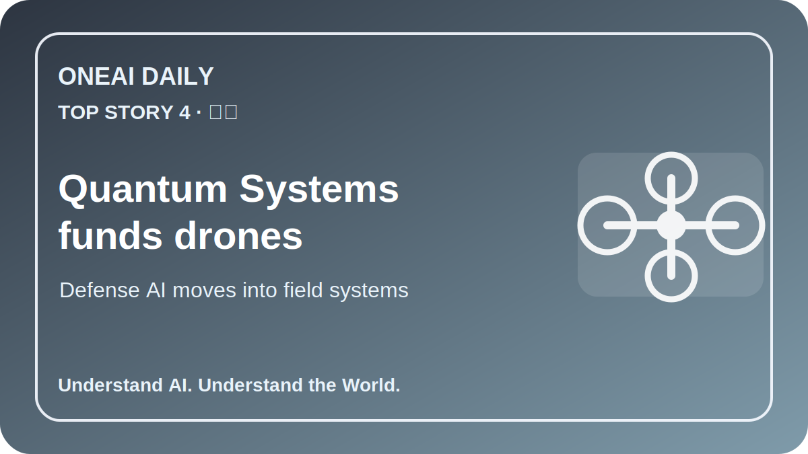

# OneAI Daily｜今日AI要闻

## 1. AI 政策｜阿根廷提出 AI 运营公司法案

阿根廷总统 Javier Milei 推动“非人类公司”相关法案，允许 AI 参与公司运营；但草案仍要求人类管理员监督 AI 决策，同时也为 DAO 提供法律框架。

**为什么重要：** 这不是“公司完全交给 AI”的终点，而是 AI 进入公司法、责任归属和监管沙盒的起点。未来真正关键的问题是：AI 决策造成损失时，由谁承担责任，以及监管如何验证“人类监督”不是形式主义。

**来源：** Reuters, “Argentina's plan for AI-run companies can't avoid humans”, 2026-07-03.  
https://www.reuters.com/world/americas/argentinas-plan-ai-run-companies-cant-avoid-humans-2026-07-03/

---

## 2. 市场｜资金重新流入 AI 与科技股

截至 7 月 1 日当周，美国股票基金由前一周净流出转为净流入，科技板块基金吸引约 34.2 亿美元资金，成为反弹主线之一。

**为什么重要：** AI 交易并未退潮，而是在从“概念行情”转向芯片、硬件、数据中心和现金流可验证的基础设施资产。资金流向显示，投资者仍愿意押注 AI，但更偏好可量化收入与供应链瓶颈环节。

**来源：** Reuters, “US equity funds draw inflows as tech buying resumes”, 2026-07-03.  
https://www.reuters.com/business/us-equity-funds-draw-inflows-tech-buying-resumes-2026-07-03/

---

## 3. 创业｜快手 AI 视频部门 Kling 融资 28 亿美元

Kuaishou 旗下 AI 视频部门 Kling 在计划分拆前完成约 28 亿美元融资，估值约 180 亿美元，投资方包括 CPE、腾讯、CITIC Securities 等。

**为什么重要：** AI 视频正从“模型演示”进入资本化与平台化阶段。广告、短视频、影视生产和社媒内容工具，将成为中美 AI 竞争的新战场。Kling 的融资也说明，中国生成式视频公司正在尝试以独立融资和潜在上市来加速商业化。

**来源：** The Wall Street Journal, “Kling Raises $2.8 Billion Amid Planned Spinoff From Kuaishou”, 2026-07-03.  
https://www.wsj.com/tech/kling-raises-2-billion-amid-planned-spinoff-from-kuaishou-8fcd1571

---

## 4. 工程与地缘｜德国无人机公司 Quantum Systems 融资 12 亿美元

德国无人机制造商 Quantum Systems 完成 12 亿美元融资，估值约 80 亿美元，资金将用于扩大无人机产能，并发展与 Mosaic UXS 软件生态连接的自主系统。该公司去年在乌克兰执行超过 19,000 次无人机任务。

**为什么重要：** AI 正快速进入真实战场和国防供应链。自动化、传感器融合、无人机集群和跨域无人系统，正在从软件演示走向高频部署，也让欧洲安全科技投资进入新周期。

**来源：** Reuters, “German drone maker Quantum Systems secures $1.2 billion funding”, 2026-07-02.  
https://www.reuters.com/business/aerospace-defense/german-drone-maker-quantum-systems-secures-12-billion-funding-2026-07-02/

---

## 5. AI 基础设施｜UBS 称硬件股正在超越 hyperscaler

UBS Holt 研究认为，AI 基础设施公司在现金流回报率上正超过大型云厂商，内存、半导体和硬件供应链成为新一轮价值创造中心。

**为什么重要：** 这意味着 AI 产业链的利润池可能从模型和云平台，继续外溢到 HBM、封装、网络、服务器与电力基础设施。对投资者和创业者来说，AI 的“铲子和电网”正在变得和模型本身一样重要。

**来源：** MarketWatch, “AI infrastructure stocks have overtaken the tech hyperscalers in a shift UBS calls ‘extraordinary’”, 2026-07-03.  
https://www.marketwatch.com/story/ai-infrastructure-stocks-have-overtaken-big-tech-hyperscalers-in-an-extraordinary-shift-says-ubs-research-arm-7c425a02

---

## 发布备注

- digest 已控制在 10 个中文字符以内：`今日AI要闻`
- 配图使用 SVG，便于 Git 版本管理；若公众号发布脚本只接受 PNG，可在发布前用现有图片生成/转换脚本输出 PNG。
- 本文为 Markdown 源稿，可用于生成公众号 HTML、草稿箱素材或本地预览。
