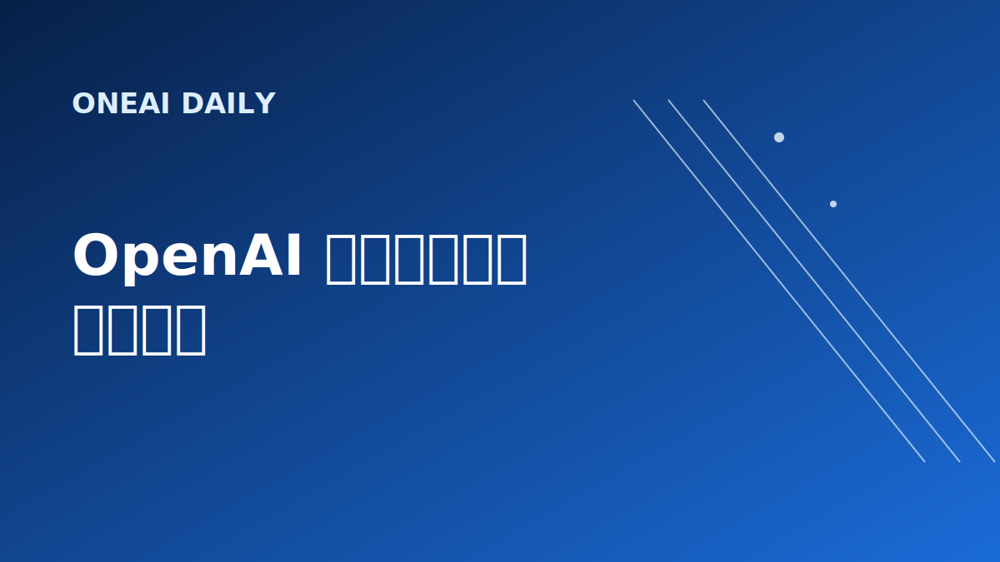
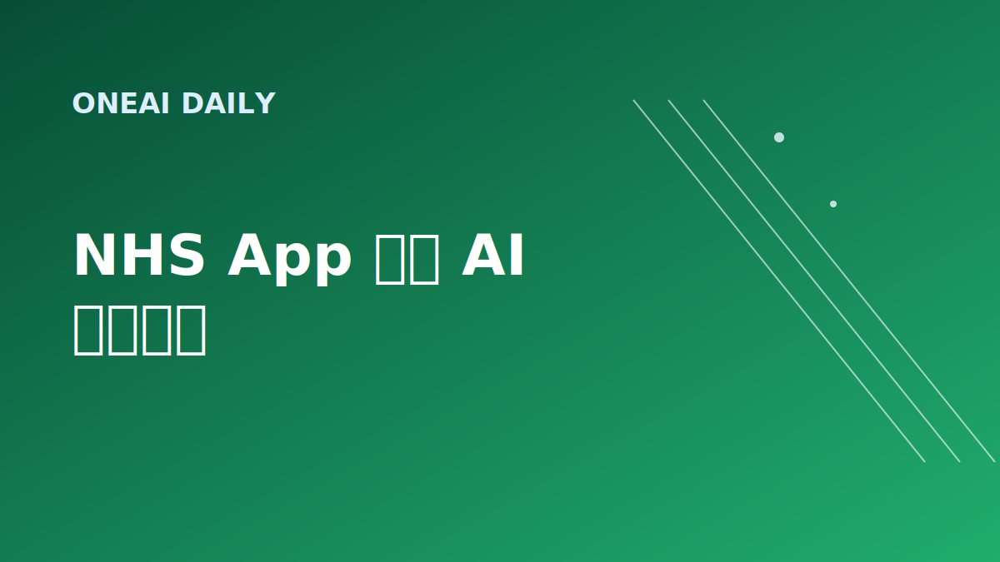
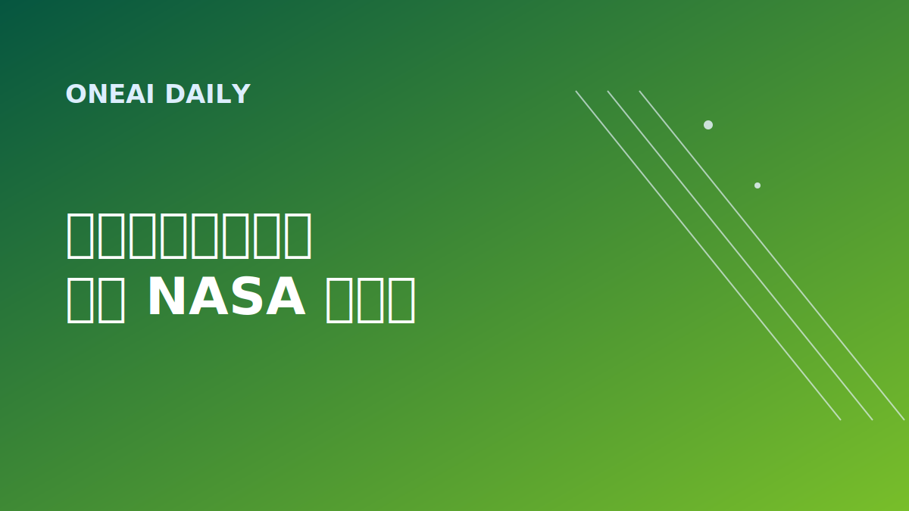

# OneAI Daily｜今日AI要闻

> 今日重点来自过去 24 小时内发布的 AI、科技与商业新闻；因周末市场与工程类新闻更新较少，保留两条最近数日仍在发酵的延展观察。

## 1. AI 基建｜OpenAI 英国 Stargate 项目被质疑为“纸面投资”

《卫报》调查称，英国政府此前宣传的 Stargate UK 数据中心项目中，所谓 300 亿英镑投资里有 200 亿英镑更像是“潜在成本”而非实际承诺；OpenAI 与合作方 Nscale 似乎也未访问关键数据中心选址，项目已在 2026 年 4 月因能源成本与监管顾虑暂停。

**为什么重要：** AI 基建正在从“宣布投资”进入“验证落地”的阶段。数据中心、电力、监管和本地就业承诺都将成为衡量 AI 资本开支真实性的硬指标。

**来源：** The Guardian, “OpenAI’s apparent failure to visit key site raises questions over UK investment”, 2026-07-04.  
https://www.theguardian.com/technology/2026/jul/04/openai-apparent-failure-visit-key-site-questions-stargate-uk-project

---

## 2. 产品与政策｜NHS App 将用 AI 为患者分诊

英国 NHS 将在官方 App 中加入 AI 分诊工具，先覆盖约 20 万名患者，帮助判断用户应预约 GP、去药房还是前往急诊；官方目标是在 2028 年 4 月前向所有用户开放。此前 Sussex 试点让电话排队人数下降 29%。

**为什么重要：** 这是 AI 从“辅助医生”走向“重排医疗入口”的典型案例。真正的考验不只是效率提升，还包括误分诊责任、隐私保护、数字鸿沟，以及基层医疗系统能否承接算法带来的流量变化。

**来源：** The Guardian, “NHS to use AI on its app to direct patients to appropriate services”, 2026-07-04.  
https://www.theguardian.com/society/2026/jul/04/nhs-ai-app-patients-appropriate-services-health

---

## 3. 创业｜小企业用 AI 快速启动和扩张

Reuters 报道了 Here Now Health 的案例：创始人 Michelle Turner 没有传统商学院背景，却用 AI 学习创业、写商业计划并融资；这家面向寄养儿童心理健康服务的平台成立于 2025 年 1 月，如今已进入三个州并拥有 16 名员工。

**为什么重要：** AI 的商业价值不只体现在大模型公司，也体现在降低普通创业者的知识、运营和融资门槛。它可能让小团队更快进入受监管行业，但也会放大“会用 AI 的人”和“不会用 AI 的人”之间的生产率差距。

**来源：** Reuters, “For one small business, AI was key to a quick start and expansion”, 2026-07-04.  
https://www.reuters.com/business/healthcare-pharmaceuticals/one-small-business-ai-was-key-quick-start-expansion-2026-07-04/

---

## 4. 市场｜AI 资金流向从超级平台转向基础设施

UBS Holt 研究认为，AI 基础设施公司在现金流回报率上已超过大型云厂商；半导体、硬件、内存与电力链条正在成为新一轮 AI 价值创造中心。MarketWatch 同日指出，这代表科技行业利润池正在从 hyperscaler 向“卖铲子”的基础设施层迁移。

**为什么重要：** 如果 AI 的约束从模型能力转向算力、电力、散热和供应链，投资与创业机会也会从应用层外溢到芯片、网络、能源和工程服务。

**来源：** MarketWatch, “AI infrastructure stocks have overtaken the tech hyperscalers in a shift UBS calls ‘extraordinary’”, 2026-07-03.  
https://www.marketwatch.com/story/ai-infrastructure-stocks-have-overtaken-big-tech-hyperscalers-in-an-extraordinary-shift-says-ubs-research-arm-7c425a02

---

## 5. 工程｜Katalyst 发射机器人航天器拯救 NASA Swift 望远镜

Arizona 航天创业公司 Katalyst 发射机器人航天器 LINK，目标是与老化的 NASA Neil Gehrels Swift Observatory 对接，把这台约 5 亿美元的天文观测设备拖升到更高轨道。该任务与 NASA 以 3000 万美元合同合作，计划一个月后会合，并用约 60 天完成轨道提升。

**为什么重要：** 如果成功，这将成为美国首次轨道卫星救援尝试。它验证的不只是维修一台望远镜，而是低轨服务、机器人对接、空间物流和未来军民两用在轨基础设施的工程能力。

**来源：** Reuters, “Space startup Katalyst launches orbital rescue mission for aging NASA observatory”, 2026-07-03.  
https://www.reuters.com/business/aerospace-defense/space-startup-katalyst-launches-orbital-rescue-mission-aging-nasa-observatory-2026-07-03/

---

## 发布备注

- digest 已控制在 10 个中文字符以内：`今日AI要闻`
- 本文配图为 SVG 卡片；发布前可运行图片脚本生成同名 PNG。
- 本文适合直接进入公众号草稿生成流程。
