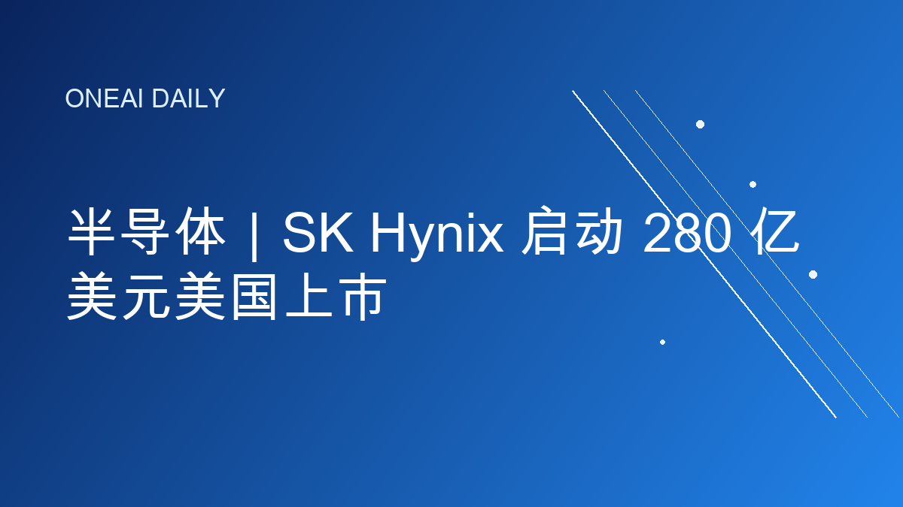
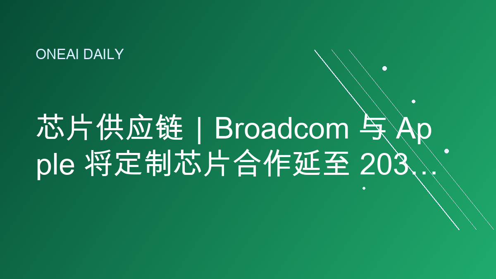
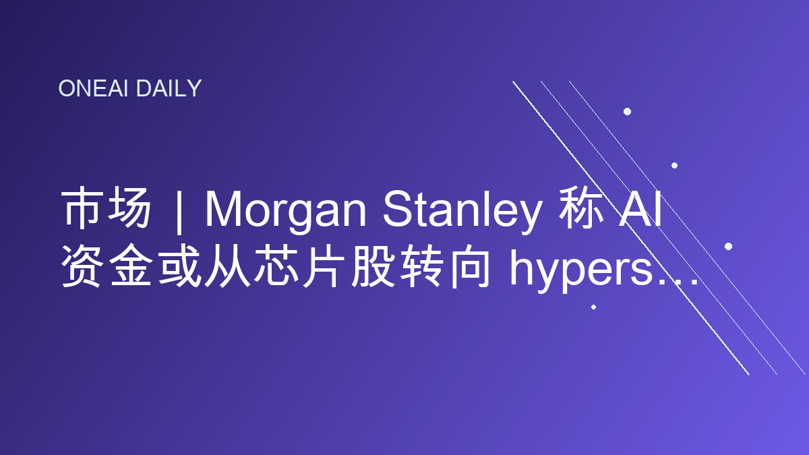
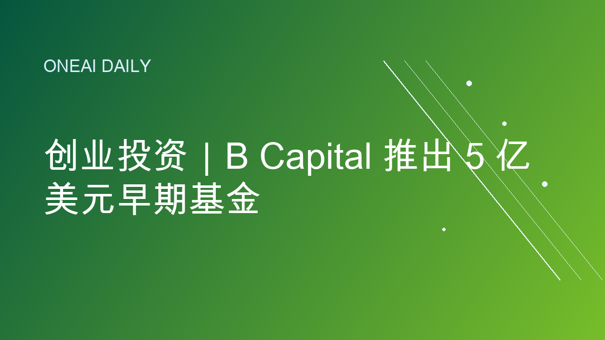

# OneAI Daily｜今日AI要闻

## 1. 半导体｜SK Hynix 启动 280 亿美元美国上市

Reuters 7 月 6 日报道，韩国存储芯片巨头 SK Hynix 启动美国 ADR 发行，计划融资约 280.7 亿美元，成为全球史上规模最大的股票发行之一。公司将发行 1,779 万股新股对应的 Nasdaq 存托凭证，Baillie Gifford、Coatue 与 Situational Awareness Partners 已表达最高合计 70 亿美元的认购兴趣。

**为什么重要：** AI 资本开支正在把“内存超级周期”推到资本市场中心。HBM 和先进存储不再只是 Nvidia 服务器的配套零件，而是决定 AI 训练、推理成本和数据中心交付速度的关键瓶颈。

**来源：** Reuters, “South Korea's SK Hynix launches $28 billion US listing to ride global AI wave”, 2026-07-06.  
https://www.reuters.com/world/asia-pacific/south-koreas-sk-hynix-launch-28-billion-us-listing-ride-global-ai-wave-2026-07-06/

---

## 2. 芯片供应链｜Broadcom 与 Apple 将定制芯片合作延至 2031 年

Reuters 7 月 6 日报道，Broadcom 宣布把与 Apple 的定制芯片开发与供应合作延长至 2031 年。Apple 约占 Broadcom 年收入的 20%；协议缓解了市场对 Apple 短期内全面自研替代 Broadcom 零部件的担忧。报道还提到，AI 数据中心需求推动内存成本在 2026 年初大涨，Apple 已被迫提高部分 MacBook 和 iPad 价格。

**为什么重要：** AI 热潮正在挤压整个半导体供应链，而不只是 GPU。大厂即使推进自研芯片，也仍需要长期锁定关键射频、连接、网络和定制硅供应，供应链确定性正在成为产品节奏的一部分。

**来源：** Reuters, “Broadcom secures role as key Apple supplier with chip deal through 2031”, 2026-07-06.  
https://www.reuters.com/technology/broadcom-apple-extend-chip-partnership-through-2031-2026-07-06/

---

## 3. 政策｜联合国秘书长呼吁建立全球 AI 规则保护儿童

Reuters 7 月 6 日报道，联合国秘书长 António Guterres 在日内瓦首届政府级 AI 治理全球对话上警告，AI 的发展速度已经超过监管和开发者自身的把握能力。他呼吁建立全球协调的 AI 规则，并提出 AI Child Safety Pledge，要求企业在面向儿童开放系统前证明其安全性。

**为什么重要：** AI 治理正在进入多边外交议程。儿童安全、选举操纵、网络安全、劳动力冲击和算力集中，都不是单一国家能独立解决的问题；但规则能否落地，取决于主要 AI 公司和美中欧等关键参与者是否愿意接受可验证约束。

**来源：** Reuters, “UN's Guterres warns AI outpacing oversight, urges global rules to protect children”, 2026-07-06.  
https://www.reuters.com/technology/un-chief-warns-ai-is-developing-faster-than-rules-can-keep-up-2026-07-06/

---

## 4. 市场｜Morgan Stanley 称 AI 资金或从芯片股转向 hyperscaler

Reuters 7 月 6 日报道，Morgan Stanley 认为，美国半导体股近期走弱可能意味着 AI 交易正在扩散，投资者或从芯片制造商转向 Alphabet、Amazon、Meta 等大规模建设数据中心的 hyperscaler。该行称，市场仍缺乏足够证据证明 AI 产品回报能完全支撑高额资本开支，但 hyperscaler 已经历一轮明显落后表现。

**为什么重要：** AI 投资主线开始从“谁卖铲子”转向“谁能把算力变现”。如果资本开支纪律提升、芯片涨幅回落，市场会更关注云厂商能否把 AI 需求转化为收入、利润率和自由现金流。

**来源：** Reuters, “AI investors may pivot to hyperscalers from chipmakers, Morgan Stanley says”, 2026-07-06.  
https://www.reuters.com/business/ai-investors-may-pivot-hyperscalers-chipmakers-morgan-stanley-says-2026-07-06/

---

## 5. 创业投资｜B Capital 推出 5 亿美元早期基金

WSJ Pro 7 月 6 日报道，B Capital 推出第三支早期基金 Ascent Fund III，硬上限为 5 亿美元，规模接近 2022 年上一支 2.54 亿美元基金的两倍。该基金主要投向种子轮和 A 轮，也会少量参与 B 轮，重点覆盖机器人、国防科技、空间基础设施等方向。

**为什么重要：** AI 与硬科技正在抬高早期创业估值和融资门槛。即使是早期投资，机构也需要更大基金规模来获得足够股权；与此同时，资金正从纯软件 AI 应用扩展到机器人、国防、空间和工程密集型基础设施。

**来源：** WSJ Pro, “B Capital Unveils $500 Million Early-Stage Fund as Startup Valuations Soar”, 2026-07-06.  
https://www.wsj.com/pro/venture-capital/b-capital-unveils-500-million-early-stage-fund-as-startup-valuations-soar-cd73bc9e

---

## 发布备注

- digest 已控制在 10 个中文字符以内：`今日AI要闻`
- 图片引用为 PNG 卡片路径，可用脚本自动生成公众号配图。
- 发布前建议运行：`FORCE_REGENERATE_IMAGES=1 python scripts/generate_article_images.py content/daily/2026-07-07-daily-briefing.md`
