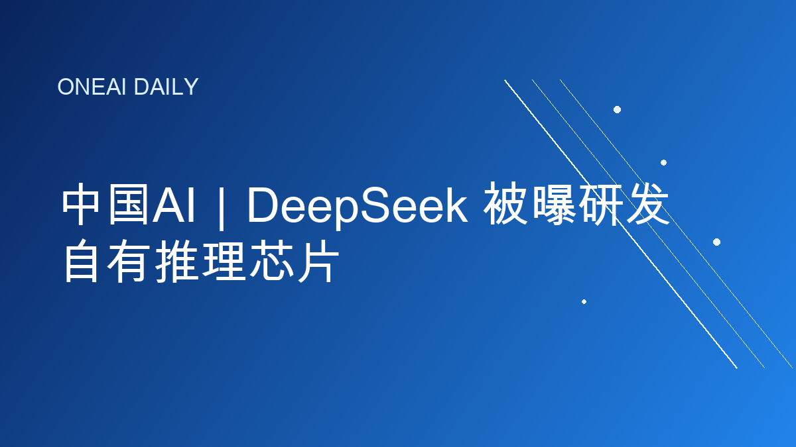
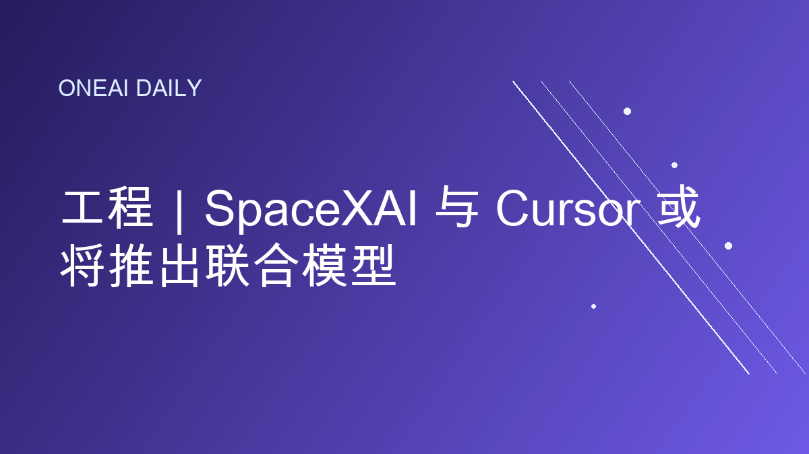

# OneAI Daily｜今日AI要闻

## 1. 中国AI｜DeepSeek 被曝研发自有推理芯片

Reuters 7 月 7 日援引知情人士称，DeepSeek 正在研发面向推理场景的自有 AI 芯片，以降低对 Nvidia 与华为芯片的依赖。项目仍处早期，DeepSeek 已私下招聘芯片设计工程师，并接触设计、代工和存储伙伴；此前公司也被曝计划进行首轮外部融资。

**为什么重要：** AI 竞争正在从模型效率扩展到算力供应链。推理需求增长意味着成本、功耗和供应稳定性会成为模型公司新的护城河；但先进代工和高带宽内存限制，也让中国 AI 芯片自研面临现实天花板。

**来源：** Reuters, “China's DeepSeek developing its own AI chip, sources say”, 2026-07-07.

---

## 2. 市场｜AI 芯片股拖累 Nasdaq 下跌

Reuters 7 月 7 日报道，Nasdaq 当日收跌 1.16%，Micron 与 Sandisk 等芯片股走弱，PHLX 半导体指数下跌 4.65%。Samsung 强劲业绩未能安抚投资者，反而加剧市场对 AI 数据中心建设周期、芯片估值和盈利可持续性的担忧。

**为什么重要：** AI 交易进入“验证回报”的阶段。过去一年资金追逐算力瓶颈和存储涨价，但只要市场开始质疑资本开支回报，芯片链条就可能从最强主线变成波动源，影响整个科技股估值。

**来源：** Reuters, “Nasdaq sinks as AI worries hit chipmakers”, 2026-07-07.

---

## 3. 产品｜Meta 推出新一代图像生成模型

Axios 与 Financial Times 7 月 7 日报道，Meta 推出新的内部图像生成模型，并计划把相关能力用于 WhatsApp、Instagram、广告创意和 Meta AI 等场景。报道称，该模型是 Meta 近期 AI 组织重组后的首个重要图像模型发布，显示公司正把追赶重点放在社交产品和商业化场景。

**为什么重要：** 图像生成正在从独立工具变成平台级功能。Meta 的优势不只是模型跑分，而是可以把生成式视觉能力直接嵌入社交、广告和创作者工作流；这会加速 AI 从“聊天入口”走向内容生产基础设施。

**来源：** Axios, “Meta's AI catch-up effort gets a new look”, 2026-07-07; Financial Times, “Meta releases first image model since Mark Zuckerberg's AI overhaul”, 2026-07-07.

---

## 4. 工程｜SpaceXAI 与 Cursor 或将推出联合模型

Reuters 7 月 7 日援引 The Information 报道称，SpaceXAI 与 Cursor 最快可能在周三推出首个联合开发模型，目标是提升信息处理速度，并在 AI 编程与企业市场中对标头部模型。报道还提到，该发布此前因效率优化而延后。

**为什么重要：** AI 编程助手正在成为大模型商业化最硬的战场之一。Cursor 的开发者入口叠加 SpaceXAI 的算力和模型能力，可能把“IDE 内模型”从插件体验推进到更深层的工程代理工作流。

**来源：** Reuters, “SpaceXAI plans to launch new model with Cursor as soon as Wednesday, The Information reports”, 2026-07-07.

---

## 5. 治理｜AI 公司安全承诺被指后退

Axios 7 月 7 日报道，Future of Life Institute 的新 AI Safety Index 指出，多家头部 AI 公司在能力继续提升的同时，削弱或放弃了部分早期安全承诺，尤其是达到危险能力阈值时暂停开发的自愿承诺。该报告发布背景，是联合国在日内瓦举行政府级 AI 治理对话，讨论全球协调规则和儿童安全。

**为什么重要：** 自愿承诺正在经受商业竞争压力测试。当模型更强、用途更广、军事和企业场景更复杂时，监管者会更关注承诺是否可验证、谁来审计、以及公司是否愿意在商业窗口期真正按下暂停键。

**来源：** Axios, “AI companies retreat from safety pledges even as capabilities grow”, 2026-07-07; Reuters, “UN's Guterres warns AI outpacing oversight, urges global rules to protect children”, 2026-07-06.

---

## 发布备注

- digest 已控制在 10 个中文字符以内：`AI芯片安全`
- 正文已按当前公众号模式处理：只显示来源信息，不显示裸链接，不放每条新闻的阅读原文按钮，`content_source_url` 保持为空。
- 图片引用为生成式 PNG 卡片路径，可由本地发布脚本自动生成。
