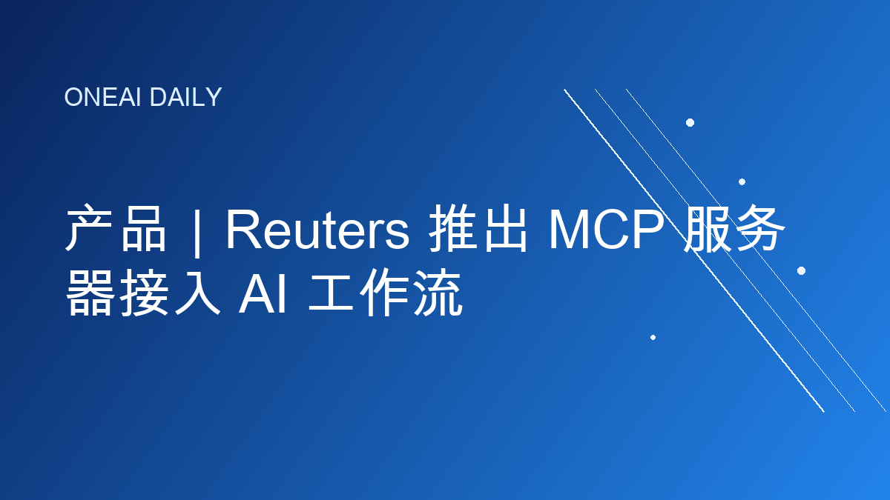
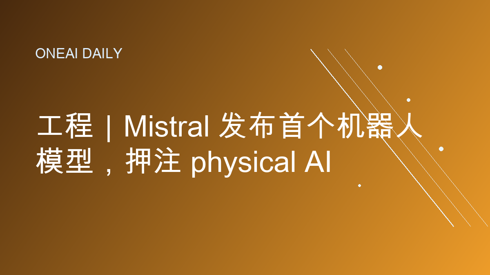
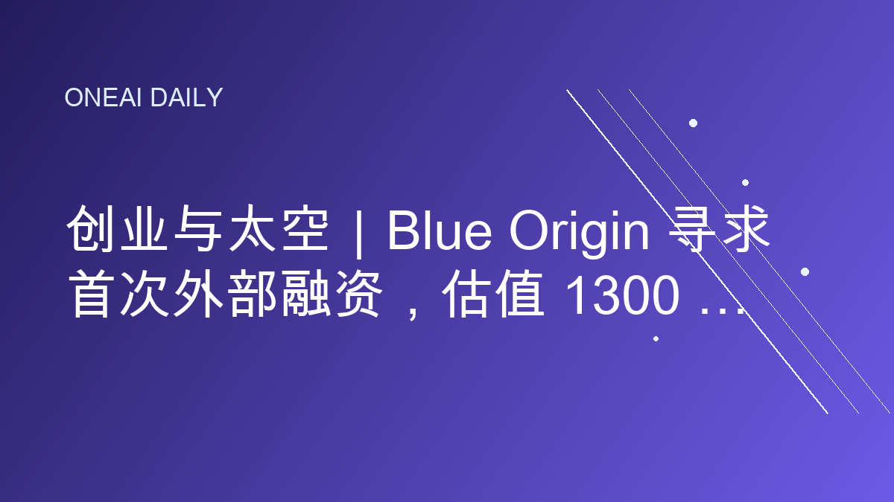
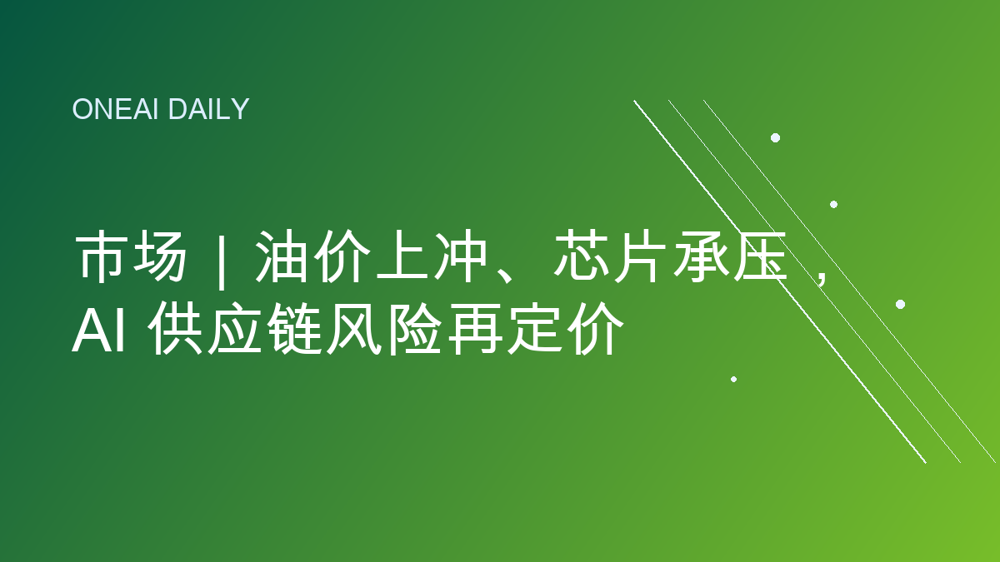

# OneAI Daily｜今日AI要闻

## 1. 产品｜Reuters 推出 MCP 服务器接入 AI 工作流

Reuters 7 月 8 日宣布推出 Model Context Protocol 服务器，让客户可以在 AI 代理和内部工作流中直接搜索、检索和下载已订阅的 Reuters News Agency 内容。该产品面向编辑、研究和内容生产场景，目标是减少人工查找新闻素材的时间，并支持更自动化的内容组装。

**为什么重要：** 新闻、研究和企业知识库正在从“网页检索”进入“代理调用”阶段。MCP 这类协议把高质量内容变成 AI 系统可直接访问的工具，也会让内容授权、来源可信度和企业内知识集成成为新一轮 AI 产品竞争点。

**来源：** Reuters, “Reuters launches Model Context Protocol server to bring trusted news directly into customers' AI workflows”, 2026-07-08.

---

## 2. 基建｜Meta 将在加拿大建设 91 亿美元 AI 数据中心

Reuters 7 月 8 日报道，Meta 将在加拿大阿尔伯塔省 Sturgeon County 投资约 130 亿加元，建设其首个加拿大数据中心。该设施初始规模约 1 吉瓦，可扩展至 1.8 吉瓦，将成为 Meta 全球第 33 个数据中心，并由天然气与可再生能源抵消计划共同支撑。

**为什么重要：** AI 基建竞争的核心正在从 GPU 采购外溢到电力、土地、冷却和监管。加拿大阿尔伯塔以低成本天然气、寒冷气候和招商政策吸引 hyperscaler，但也把 AI 增长与化石能源、用电公平和电网扩容争议更紧密地绑在一起。

**来源：** Reuters, “Meta to build C$13 billion Alberta data center, its first in Canada”, 2026-07-08; AP, “Meta plans billions for first AI data center in Canada, largest outside the US”, 2026-07-08.

---

## 3. 工程｜Mistral 发布首个机器人模型，押注 physical AI

Reuters 7 月 8 日报道，法国 AI 公司 Mistral 推出首个机器人模型，正式进入 physical AI 方向，主要面向工厂、仓库等工业自动化场景。该动作发生在 Mistral 5 月收购奥地利公司 Emmi AI 之后，也与 Genesis AI 等公司在导航和操作模型上的进展形成竞争。

**为什么重要：** 大模型竞争正在从文本、图像和代码走向现实世界执行。机器人模型把感知、规划和动作控制连接起来，但真正落地还取决于安全验证、硬件成本、场景泛化和工业客户愿不愿意改造生产流程。

**来源：** Reuters, “Mistral launches first robotics model in physical AI push”, 2026-07-08.

---

## 4. 创业与太空｜Blue Origin 寻求首次外部融资，估值 1300 亿美元

Reuters 7 月 8 日援引 NYT DealBook 报道称，Jeff Bezos 的 Blue Origin 正寻求首次外部融资，目标融资 100 亿美元，投前估值约 1300 亿美元。Coatue Management 预计将领投 40 亿美元，Bezos 本人也计划追加 20 亿美元。报道还提到，公司探索 Project Sunrise，即面向轨道数据中心的卫星网络。

**为什么重要：** 太空基础设施正在被重新定价。SpaceX 上市带动投资者重新评估发射、卫星互联网、国防合同和未来轨道算力的商业价值；但 Blue Origin 仍面临发射频率、收入规模和重型火箭可靠性的长期追赶压力。

**来源：** Reuters, “Bezos' Blue Origin seeks first outside funding at $130 billion valuation, NYT DealBook reports”, 2026-07-08.

---

## 5. 市场｜油价上冲、芯片承压，AI 供应链风险再定价

Reuters 7 月 8 日 Morning Bid 指出，地缘冲突推动油价上行，同时芯片股走弱；市场还关注中国可能限制外国访问其领先 AI 模型，以及 DeepSeek 等公司推进自有半导体基础设施的影响。Axios 同日分析称，AI 公司纷纷自研芯片，但先进制程、内存和封装仍集中在狭窄供应链中。

**为什么重要：** AI 市场不再只是模型能力和应用收入的故事。能源价格、出口限制、晶圆代工、HBM、先进封装和数据中心电力都会影响算力成本；当这些瓶颈同时收紧，AI 资产估值会更容易受宏观和地缘风险冲击。

**来源：** Reuters Morning Bid, “Oil spikes, chips slide”, 2026-07-08; Axios, “The AI chip rush is crowding the same narrow pipeline”, 2026-07-08.

---

## 发布备注

- digest 已控制在 10 个中文字符以内：`AI基建机器人`
- 正文已按当前公众号模式处理：只显示来源信息，不显示裸链接，不放每条新闻的阅读原文按钮，`content_source_url` 保持为空。
- 图片引用为生成式 PNG 卡片路径，可由本地发布脚本自动生成。
